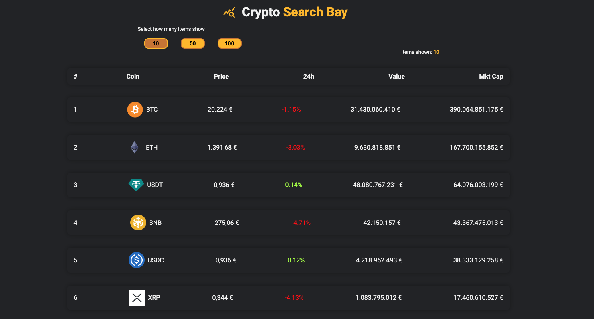
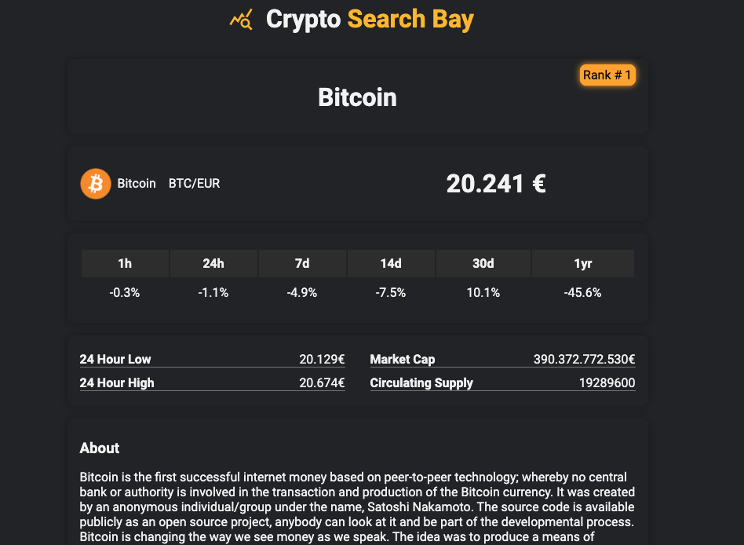

# Crypto Search Bay
Simple react app made with typescript and coingecko free api.

For now the currency is Eur (€).

I just made this project for use the coingecko api and check crypto info

## Sections
###  `Home`
In home you can see a list of top cryptocurrency

###  `Coin Details`
In details you can see a lot of imformation about a single coin

## `Other`
There are other components such as:
 - Error message
 - Loader
 - Filters button for the number of list

## `More info`
This project was bootstrapped with [Create React App](https://github.com/facebook/create-react-app).

#### Scrypt `npm start`

Runs the app in the development mode.\
Open [http://localhost:3000](http://localhost:3000) to view it in the browser.

## `In the future`
I have a list of task to complete this projet 

 - [ ] Deploy on firebase
 - [ ] Typing the response by coingecko

 - [ ] FIX double call for strict mode
 - [ ] Add loader in home
 - [ ] add possibility to choose the currency
 
## Help

Any help or advice is welcome thanks
## License and author
- [Elvio Moretti](https://github.com/ecali)

